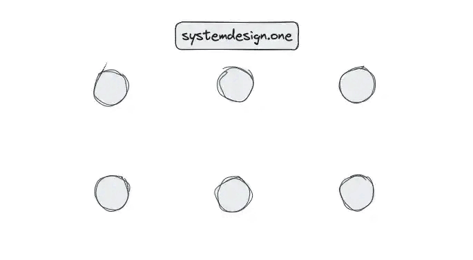

# High-Level System Design: Scalability, Availability, CAP Theorem, ACID Transactions, and More

## 1. Scalability

As a system grows, the performance starts to degrade unless we adapt it to deal with that growth.

Scalability is the property of a system to handle a growing amount of load by adding resources to the system.

A system that can continuously evolve to support a growing amount of work is scalable.

## How can a System grow?
1. More Users
2. More Data
3. More Traffic
4. More Features
5. More Operations
6. More Geogrpahical Locations
7. More Devices
8. More Platforms

### 1. Growth in User Base
More users start using the system, leading to an increased number of requests.

**Example:** A social media platform experiencing a surge in new users.

### 2. Growth in Features
More features are introduced to expand the system's capabilities.

**Example:** An e-commerce website adding support for a new payment method.

### 3. Growth in Data Volume
The amount of data the system stores and manages increases due to user activity or logging.

**Example:** A video streaming platform like YouTube storing more video content over time.

### 4. Growth in Complexity
The system's architecture evolves to accommodate new features, scale, or integrations, resulting in additional components and dependencies.

**Example:** A system that started as a simple application is broken into smaller, independent microservices.

### 5. Growth in Geographic Reach
The system is expanded to serve users in new regions or countries.

**Example:** An e-commerce company launching websites and distribution centers in new international markets.

## Definition:
Scalability is the ability of a system to handle increased workload or growing amounts of data efficiently by adding resources (such as more servers, memory, or processing power).

## How to scale a system?
### 1. Vertical Scalability (Scaling Up)
 Increasing the capacity of a single machine (e.g., adding more CPU, RAM, or storage).
 This means adding more power to your existing machines by upgrading server with more RAM, faster CPUs, or additional storage.

It's a good approach for simpler architectures but has limitations in how far you can go.


### 2. Horizontal Scalability (Scaling Out)
Adding more machines to distribute the load.
This means adding more machines to your system to spread the workload across multiple servers.

It's often considered the most effective way to scale for large systems.

Example: Netflix uses horizontal scaling for its streaming service, adding more servers to their clusters to handle the growing number of users and data traffic.

### 3. Load Balancing
Load balancing is the process of distributing traffic across multiple servers to ensure no single server becomes overwhelmed.

Example: Google employs load balancing extensively across its global infrastructure to distribute search queries and traffic 
evenly across its massive server farms.

### 4. Caching
Caching is a technique to store frequently accessed data in-memory (like RAM) to reduce the load on the server or database.

Implementing caching can dramatically improve response times.

Example: Reddit uses caching to store frequently accessed content like hot posts and comments so that they can be served 
quickly without querying the database each time.

### 5. Content Delivery Networks (CDNs)
CDN distributes static assets (images, videos, etc.) closer to users. This can reduce latency and result in faster load times.

Example: Cloudflare provides CDN services, speeding up website access for users worldwide by caching content in servers located close to users.

### 6. Sharding/Partitioning
Partitioning means splitting data or functionality across multiple nodes/servers to distribute workload and avoid bottlenecks.

Example: Amazon DynamoDB uses partitioning to distribute data and traffic for its NoSQL database service across many servers, ensuring fast performance and scalability.

### 7. Asynchronous communication
Asynchronous communication means deferring long-running or non-critical tasks to background queues or message brokers.

This ensures your main application remains responsive to users.

Example: Slack uses asynchronous communication for messaging. When a message is sent, the sender's interface doesn't freeze; it continues to be responsive while the message is processed and delivered in the background.

### 8. Microservices
Micro-services architecture breaks down application into smaller, independent services that can be scaled independently.

This improves resilience and allows teams to work on specific components in parallel.

Example: Uber has evolved its architecture into microservices to handle different functions like billing, notifications, and ride matching independently, allowing for efficient scaling and rapid development.

### 9. Auto Scaling
Auto-Scaling means automatically adjusting the number of active servers based on the current load.

This ensures that the system can handle spikes in traffic without manual intervention.

Example: AWS Auto Scaling monitors applications and automatically adjusts capacity to maintain steady, predictable performance at the lowest possible cost.


### 10. Multi-Region Deployment
Deploy the application in multiple data centers or cloud regions to reduce latency and improve redundancy.

Example: Spotify uses multi-region deployments to ensure their music streaming service remains highly available and responsive to users all over the world, regardless of where they are located.


---

## 2. Availability
### Definition:
Availability refers to the system's ability to remain operational and accessible despite failures.
Availability refers to the proportion of time a system is operational and accessible when required.

It is usually expressed as a percentage, indicating the system's uptime over a specific period.

The formal definition of availability is:

### Availability = Uptime / (Uptime + Downtime)
**Uptime:** The period during which a system is functional and accessible.

**Downtime:** The period during which a system is unavailable due to failures, maintenance, or other issues.

## High Availability (HA) Techniques:
### Redundancy: 
Keeping multiple copies of data and services.


###Techniques:
**Server Redundancy:** Deploying multiple servers to handle requests, ensuring that if one server fails, others can continue to provide service.

**Database Redundancy:** Creating a replica database that can take over if the primary database fails.

**Geographic Redundancy:** Distributing resources across multiple geographic locations to mitigate the impact of regional failures.

### Failover Mechanisms
 Automatically switching to a backup system if the primary system fails.

### Techniques:
**Active-Passive Failover:** A primary active component is backed by a passive standby component that takes over upon failure.

**Active-Active Failover:** All components are active and share the load. If one fails, the remaining components continue to handle the load seamlessly.

###Replication
Keeping multiple copies of data across different servers.


### Load Balancing
Distributing requests to prevent overload.

###Techniques:
**Hardware Load Balancers:** Physical devices that distribute traffic based on pre-configured rules.

**Software Load Balancers:** Software solutions that manage traffic distribution, such as HAProxy, Nginx, or cloud-based solutions like AWS Elastic Load Balancer.

- **Self-Healing Systems**: Detecting and recovering from failures automatically.

### Monitoring and Alerting:
Continuously monitoring system health and performance to detect issues early and take corrective action.


---

## 3. CAP Theorem
### Definition:
CAP Theorem states that a distributed system can only guarantee **two out of the three** properties at any given time:

1. **Consistency (C)**: All nodes in the system see the same data at the same time.
2. **Availability (A)**: Every request receives a response, even if some nodes are down.
3. **Partition Tolerance (P)**: The system continues to operate despite network failures.A network partition occurs when a network failure causes a distributed system to split into two or more groups of nodes that cannot communicate with each other.
When there is a network partition, the system must choose between Consistency and Availability.
Partition Tolerance is essential for distributed systems because network failures can and do happen. A system that tolerates partitions can maintain operations across different network segments.

### CAP Trade-offs:
- **CA (Consistency + Availability)**: Used when network partitions are rare, such as in relational databases.
Example Systems: Single-node databases can provide both consistency and availability but aren't partition-tolerant. In a distributed setting, this combination is theoretically impossible.

- **CP (Consistency + Partition Tolerance)**: Prioritizes data accuracy over availability (e.g., MongoDB, HBase).
Banking systems typically prioritize consistency over availability since data accuracy is more critical than availability during network issues.

Consider an ATM network for a bank. When you withdraw money, the system must ensure that your balance is updated accurately across all nodes (consistency) to prevent overdrafts or other errors.

- **AP (Availability + Partition Tolerance)**: Ensures high availability but may return stale data (e.g., DynamoDB, Cassandra).
Amazon's shopping cart system is designed to always accept items, prioritizing availability.

When you add items to your Amazon cart, the action almost never fails, even during high traffic periods like Black Friday.
### Practical Implications:

Most real-world distributed systems choose **AP or CP**, as network failures (partitions) are inevitable.

### Eventual Consistency:
Eventual consistency allows data updates to propagate asynchronously across nodes. Given enough time, all nodes will eventually reflect the latest updates.
Allow temporary inconsistencies to achieve high availability and partition tolerance.
Example: social media feeds, where posts may appear out of order initially but eventually become consistent across all users.
         shopping carts in e-commerce platforms, where items may appear or disappear temporarily due to eventual consistency.

### Strong Consistency:
Strong consistency ensures that all nodes see the same data at the same time.
Every read receives the most recent write or an error.
Example: Banking systems, where account balances must be accurate and consistent across all nodes to prevent overdrafts or other errors.
         Stock trading platforms, where the latest prices and transactions must be consistent across all users to prevent discrepancies.


---

## 4. ACID Transactions
Imagine you’re running an e-commerce application.

A customer places an order, and your system needs to deduct the item from inventory, charge the customer’s credit card, and record the sale in your accounting system—all at once.

What happens if the payment fails but your inventory count has already been reduced? Or if your application crashes halfway through the process?

This is where ACID transactions come into play. They ensure that all the steps in such critical operations happen reliably and consistently.

## Definition:
ACID (Atomicity, Consistency, Isolation, Durability) is a set of properties ensuring reliable transactions in databases.

## ACID Properties:
### 1. Atomicity
Atomicity ensures that a transaction—comprising multiple operations—executes as a single and indivisible unit of work: it either fully succeeds (commits) or fully fails (rolls back).

If any part of the transaction fails, the entire transaction is rolled back, and the database is restored to a state exactly as it was before the transaction began.

**Example:** In a money transfer transaction, if the credit step fails, the debit step cannot be allowed to stand on its own. This prevents inconsistent states like “money disappearing” from one account without showing up in another.

Atomicity abstracts away the complexity of manually undoing changes if something goes wrong.

### 2. Consistency 
The database remains in a valid state before and after the transaction.
**Example: ** In a banking system, a transfer transaction should not leave the system in an inconsistent state where money appears to have vanished or been created out of thin air.
              

### 3. Isolation
Transactions execute independently, preventing interference.
**Example:** If two transactions are running concurrently, one should not affect the other. This prevents issues like “dirty reads” (reading uncommitted data) or “lost updates” (overwriting changes made by another transaction).

### 4. Durability
Durability ensures that once a transaction has been committed, the changes it made will survive, even in the face of power failures, crashes, or other catastrophic events.
**Example:** If a customer places an order and the system confirms the transaction, the order should not disappear if the server crashes immediately afterward.

### Use Cases:
- **Relational Databases** (e.g., MySQL, PostgreSQL) strictly follow ACID properties.

- **NoSQL Databases** may relax some ACID properties to achieve better scalability (e.g., BASE Model: Basically Available, Soft-state, Eventually consistent).

---

## 5. Consistent Hashing
### Definition:
Consistent Hashing is a technique used to distribute data across nodes in a way that minimizes reassignments when nodes are added or removed.

Consistent hashing is a special type of hashing technique that helps in distributing data across a dynamic set of nodes in a distributed system. It minimizes the number of keys that need to be remapped when a node is added or removed, making it highly scalable.

### Why Consistent Hashing?
In traditional hashing methods like modular hashing (hash(key) % n), whenever the number of nodes (n) changes, all keys need to be reassigned. This is inefficient for large-scale distributed systems.

For example:

Initially, if n = 5 (5 servers) and we add a new server (n = 6), almost all keys will be rehashed.
In contrast, consistent hashing ensures that only a minimal number of keys need to be remapped when nodes are added or removed.

### How does Consistent Hashing work?
1. **Hashing the keys:** Each key is hashed to a value in a large range (e.g., 0 to 2^32-1).
2. **Hashing the nodes:** Each node is hashed to a value in the same range.
3. **Mapping keys to nodes:** Each key is mapped to the node whose hash value is the closest clockwise to the key's hash value.
4. **Virtual Nodes:** To balance the load across nodes, multiple virtual nodes can be created for each physical node.
5. **Adding or Removing Nodes:** When a node is added or removed, only the keys that were mapped to that node need to be remapped to the next closest node in the ring.
6. **Load Balancing:** Consistent hashing helps distribute keys evenly across nodes, ensuring a balanced load distribution.


### Use Cases:
- Distributed caching (e.g., Memcached, Redis)
- Load balancing
- Distributed storage systems

### Key Advantages:
1. **Scalability:** Consistent hashing minimizes the number of keys that need to be remapped when nodes are added or removed, making it highly scalable.
2. **Load Balancing:** It helps distribute keys evenly across nodes, ensuring a balanced load distribution.
3. **Fault Tolerance:** Consistent hashing ensures that only a minimal number of keys need to be remapped when a node fails or is removed.

---

## 6. Rate Limiting
### Definition:
Rate Limiting controls the number of requests a user can make to a system within a specified time frame.

### Techniques:
### Token Bucket Algorithm
  **How it works:**
    - Requests are added to a bucket at a constant rate.
    - If the bucket is full, requests are discarded or delayed.
    - Tokens are consumed when requests are processed.
    - If there are no tokens, requests are delayed or rejected.

### Leaky Bucket Algorithm
 **How it works:**
    - Imagine a bucket with a hole at the bottom.
    - Requests are added to the bucket.
    - If the bucket overflows, requests are delayed or discarded.
    - Requests are processed at a constant rate, leaking out of the bucket.
    - If the bucket is empty, requests are delayed or rejected.
### Fixed Window Counter
 **How it works:**
    - Time is divided into fixed windows (e.g., 1-minute intervals).
    - Each window has a counter that starts at zero.
    - New requests increment the counter for the current window.
    - If the counter exceeds the limit, requests are denied until the next window.


    
### Sliding Window Log
 **How it works:**
    - Requests are logged with timestamps.
    - A sliding window tracks the number of requests in a fixed time frame.
    - If the number of requests exceeds the limit, new requests are denied.
    - Old requests are removed from the window as they expire.

---

## 7. Single Point of Failure (SPOF)
### Definition:
A SPOF is a component in a system whose failure would cause the entire system to stop functioning.


Exampple : Imagine a bridge connecting two islands. If the bridge collapses, there is no other way to travel between the islands, making it a single point of failure.

### The potential causes of SPOFs include:
- Hardware failures
- Software bugs
- Network issues
- Human errors
- Cache failures
- Database
- Load balancer
- Power supply
### Mitigation Strategies:
- Redundancy
- Load balancing
- Failover mechanisms

---

## 8. Fault Tolerance
### Definition:
Fault tolerance is the ability of a system to continue operating despite failures.

High availability V/S Fault Tolerance
- High availability focuses on ensuring that a system remains operational and accessible.
- Fault tolerance goes a step further by ensuring that a system can continue to operate even when components fail.


### Techniques:
- Replication
- Failover
- Self-healing architecture

---


## 9. Consensus Algorithms
### Definition:
Consensus algorithms ensure that multiple nodes in a distributed system agree on a single data value.
In a distributed system, multiple computers (known as nodes) are mutually connected with each other and 
collaborate with each other through message passing. Now, during computation, they need to agree upon a 
common value to coordinate among multiple processes. This phenomenon is known as Distributed Consensus.

Vote-based algorithms are used to reach an agreement among nodes in a distributed system.
Proof-Based Algorithms are used to reach an agreement among nodes in a distributed system.

### Challenges:
Crash failures: Nodes may stop responding.
Byzantine failures: Nodes may behave arbitrarily (e.g., sending incorrect messages).

### Examples:
- Paxos
- Raft
- Byzantine Fault Tolerance (BFT)

---

## 10. Gossip Protocol
### Definition:
Gossip Protocol is a communication method used in distributed systems where nodes share information in a peer-to-peer fashion.

The gossip protocol is a decentralized peer-to-peer communication technique to transmit messages in an enormous distributed system [1], [8]. 
The key concept of gossip protocol is that every node periodically sends out a message to a subset of other random nodes [8], [2]. 
The entire system will receive the particular message eventually with a high probability [11], [3]. In layman’s terms, the gossip protocol 
is a technique for nodes to build a global map through limited local interactions [1].




The gossip protocol is built on a robust, scalable, and eventually consistent algorithm. The gossip protocol is typically used to maintain the node membership list, achieve consensus, and fault detection in a distributed system [2]. In addition, additional information such as application-level data can be piggybacked on gossip messages [1].

The gossip protocol is reliable because a node failure can be overcome by the retransmission of a message by another node. First-in-first-out (FIFO) broadcast, causality broadcast, and total order broadcast can be implemented with gossip protocol [3].

### Use Cases:
- Failure detection
- Load balancing
- Database replication

---

## 11. Service Discovery
### Definition:
Service Discovery enables automatic detection of network services.

Service discovery is a mechanism that allows services in a distributed system to find and communicate with each other dynamically.

It hides the complex details of where services are located, so they can interact without knowing each other's exact network spots.

Service discovery registers and maintains a record of all your services in a service registry. This service registry acts as a single source of truth that allows your services to query and communicate with each other.

Client-side discovery: Clients query the service registry to find the location of services.
Server-side discovery: Services register themselves with the service registry, which acts as a central directory.


### Techniques:
- DNS-based discovery
- Client-side and server-side discovery
- Service registries (e.g., Consul, Eureka, Zookeeper)

---

## 12. API Design
### Definition:
API Design refers to the process of designing well-structured, scalable, and maintainable APIs.
API stands for Application Programming Interface.
APIs, or Application Programming Interfaces, are a set of rules and protocols that allows two software applications or services to communicate with each other.

As applications grow in size, the number of APIs increases too. Without the right tools and infrastructure, managing these APIs can quickly become a challenge.

This is where API Gateway comes into play.

An API Gateway acts as a central server that sits between clients (e.g., browsers, mobile apps) and backend services.

Instead of clients interacting with multiple microservices directly, they send their requests to the API Gateway. The gateway processes these requests, enforces security, and forwards them to the appropriate microservices.


At its core, an API is a bunch of code that takes an input and gives you predictable outputs.

Think of an API as a middleman that enables applications to interact without needing direct access to each other's code or database.

### Why do we need API Gateway?
Modern applications, especially those built using microservices architecture, have multiple backend services managing different functionalities.

For example, in an e-commerce service:

1.One service handles user accounts.

2.Another handles payments.

3.Another manages product inventory

### Without an API Gateway


Clients would need to know the location and details of all backend services.

Developers would need to manage authentication, rate limiting, and security for each service individually.


### With an API Gateway


Clients send all requests to one place – the API Gateway.

The API Gateway takes care of routing, authentication, security, and other operational tasks, simplifying both client interactions and backend management.

### Core Feature of API Gateway


### Best Practices:
- RESTful principles
- Proper versioning
- Authentication and authorization
- Rate limiting
- Error handling

---

## 13. Disaster Recovery
### Definition:
Disaster Recovery (DR) is a strategy to restore system functionality after failures or catastrophic events.

### Techniques:
- Backups and snapshots
- Multi-region deployment
- Disaster recovery plans

---

## 14. Distributed Tracing
### Definition:
Distributed Tracing is a technique for monitoring and debugging microservices by tracking requests across services.

### Tools:
- Jaeger
- Zipkin
- OpenTelemetry

---


```
## Summary:
| Concept                 | Key Focus                        | Techniques & Examples                            |
|-------------------------|----------------------------------|--------------------------------------------------|
| **Scalability**         | Handling growth                  | Load balancing, caching, sharding                |
| **Availability**        | System uptime                    | Failover, replication, self-healing              |
| **CAP Theorem**         | Trade-offs in distributed systems| CP (MongoDB), AP (Cassandra), CA (SQL Databases) |
| **ACID Transactions**   | Data integrity                   | MySQL, PostgreSQL                                |
| **Consistent Hashing**  | Data distribution                | Distributed caching, load balancing              |
| **Rate Limiting**       | Preventing abuse                 | Token bucket, Leaky bucket                       |
| **SPOF**                | System reliability               | Redundancy, failover                             | 
| **Fault Tolerance**     | Failure resilience               | Replication, self-healing                        |
| **Consensus Algorithms**| Agreement in distributed systems | Paxos, Raft                                      |
| **Gossip Protocol**     | Peer-to-peer communication       | Failure detection, replication                   |
| **Service Discovery**   | Automatic service detection      | Consul, Eureka                                   |
| **API Design**          | Structuring APIs                 | REST, versioning, authentication                 |
| **Disaster Recovery**   | Failure recovery                 | Backups, multi-region deployment                 |
| **Distributed Tracing** | Monitoring microservices         | Jaeger, Zipkin                                   |

```


---

## 15. Content Delivery Networks (CDNs)
### Definition:
A Content Delivery Network (CDN) is a distributed network of servers that deliver web content to users based on their geographic location.
A CDN is a geographically distributed network of servers that work together to deliver web content (like HTML pages, JavaScript files, stylesheets, images, and videos) to users based on their geographic location.

The primary purpose of a CDN is to deliver content to end-users with high availability and performance by reducing the physical distance between the server and the user.

When a user requests content from a website, the CDN redirects the request to the nearest server in its network, reducing latency and improving load times.

### How does a CDN work?
1. **Content caching:** When a user requests content, the CDN caches this content in servers located closer to the user, known as edge servers. Subsequent requests for the same content are served from these edge servers, reducing the load on the origin server.

2. **Content Delivery**: If the edge server has the requested content cached, it delivers it directly to the user. If not, it retrieves the content from the origin server, caches it for future requests, and then delivers it to the user.
 
3. ** Content is Refreshed** : CDNs periodically update cached content to ensure users receive the latest version.


---


## 16.Domain name system (DNS)
A Domain Name System (DNS) is a decentralized naming system for computers, services, or other resources connected to the Internet or a private network.

DNS server: A DNS server is a computer server that contains a database of public IP addresses and their associated hostnames, and in most cases, serves to resolve, or translate, those names to IP addresses as requested.
DNS resolver: A DNS resolver is a local server that receives DNS queries from clients and forwards them to DNS servers for resolution.

### How DNS works:
1. **User enters a domain name:** A user enters a domain name (e.g., www.example.com) into a web browser.
2. **DNS query:** The browser sends a DNS query to a DNS resolver to find the IP address associated with the domain name.
3. **DNS resolver forwards the query:** If the resolver doesn't have the IP address in its cache, it forwards the query to a DNS server.
4. **DNS server responds:** The DNS server responds with the IP address associated with the domain name.
5. **Browser connects to the server:** The browser connects to the server using the IP address obtained from the DNS query.


---

## 17.Caching
Caching is a technique used to temporarily store copies of data in high-speed storage layers (such as RAM) to reduce the time taken to access data.

### Why use caching?
1. **Faster access:** Caching reduces the time taken to access data by storing frequently accessed data in memory.
2. **Reduced load:** Caching reduces the load on the primary data source (e.g., a database) by serving cached data instead of querying the source repeatedly.
3. **Improved performance:** Caching improves system performance by reducing latency and improving response times.
4. **Cost Efficiency:** Caching can reduce costs associated with data retrieval and processing by minimizing the need to access the primary data source.

### Types of caching:
1. **Client-side caching:** Caching data on the client-side (e.g., web browser) to reduce the need to fetch data from the server.
2. **Server-side caching:** Caching data on the server to reduce the load on the primary data source.
3. **Database caching:** Caching query results in memory to reduce the time taken to retrieve data from the database.
4. **Content Delivery Networks (CDNs):** CDNs cache content (e.g., images, videos) on edge servers to reduce latency and improve load times for users.
5. **In-memory caching:** Storing data in memory (e.g., RAM) to reduce the time taken to access data.
6. **Distributed caching:** Caching data across multiple servers to improve scalability and performance.

### Cache Eviction Policies
1. **Least Recently Used (LRU):** Evicts the least recently used items first.
2. **Least Frequently Used (LFU):** Evicts the least frequently used items first.
3. **First-In-First-Out (FIFO):** Evicts the oldest items first.
4. **Random Replacement:** Evicts items randomly.


### Caching Strategies
1. **Write-through caching:** Data is written to the cache and the primary data source simultaneously.
 

2. **Read through caching:** Data is read from the cache and the primary data source if not found in the cache.
 

3. **Cache Aside (Lazy Loading):** Data is read from the cache, and if not found, it is fetched from the primary data source and stored in the cache.
 

4. **Write Around Caching:** Data is written directly to the primary data source and bypasses the cache.
 

5. **Write Back Caching:** Data is written to the cache first and then asynchronously written to the primary data source.
 

---

## 18. Data Replication
Data replication is the process of copying data from one location to another to ensure data availability, fault tolerance, and disaster recovery.
Example: Replicating a database across multiple servers to ensure data availability and fault tolerance.

### Benefits of Data Replication:
1. **High availability:** Replicated data ensures that if one copy is unavailable, another copy can be used.
2. **Fault tolerance:** Replicated data can tolerate failures in one or more copies.
3. **Disaster recovery:** Replicated data can be used to recover from data loss due to disasters or failures.
4. **Load balancing:** Replicated data can be used to distribute read and write operations across multiple servers.


## 19. Data Redundancy
Data redundancy is the duplication of data within a database or across multiple databases to ensure data availability and fault tolerance.
Example: Storing multiple copies of data in different locations to prevent data loss due to failures.

# Key Differences Between Data Replication and Data Redundancy

| **Aspect**          | **Data Replication**                                    | **Data Redundancy**                         |
|---------------------|---------------------------------------------------------|---------------------------------------------|
| **Purpose**         | Ensures availability, consistency, and fault tolerance. | Provides backup or results from poor design.|
| **Intentionality**  | Always intentional and planned.                         | Can be intentional or unintentional.        |
| **Synchronization** | Requires synchronization to maintain consistency.       | May not involve synchronization.            |
| **Storage Overhead**| Managed and optimized for performance.                  | Often leads to inefficient storage use.     |
| **Use Case**        | Distributed systems, high availability.                 | Backup, fault tolerance, or poor design.    |

---

## 20. Sharding
Sharding is a database partitioning technique that splits data across multiple servers to improve performance, scalability, and fault tolerance.

Imagine a social media site like Instagram, which has over 1 billion active users.

Think about what would happen if it tried to keep all the user profile data on a single server.

Due to limited scalability of a single machine, it would quickly run out of storage space and slow down leading to performance issues.

But what if we divided the user base into smaller groups based on a key like userId and stored each group on separate servers?


Example:

Group 1: Users with IDs 0-999

Group 2: Users with IDs 1000-1999

Group 3: Users with IDs 2000-2999

Now, a single server only deals with subset of data.

Distributing data in this way makes it easier to scale and manage more users.

This is the idea behind Database Sharding.

Database sharding is a horizontal scaling technique used to split a large database into smaller, independent pieces called shards.

These shards are then distributed across multiple servers or nodes, each responsible for handling a specific subset of the data.

### Benefits of Sharding:
1. **Scalability:** Sharding allows databases to scale horizontally by distributing data across multiple servers.
2. **Performance:** Sharding improves read and write performance by reducing the amount of data stored on each server.
3. **Fault tolerance:** Sharding increases fault tolerance by distributing data across multiple servers, reducing the impact of server failures.
4. **Isolation:** Sharding provides data isolation, allowing different shards to be managed independently.
5. **Cost efficiency:** Sharding can reduce costs associated with storing and managing large datasets by distributing data across multiple servers.

---

## 21. Web-Socket
WebSockets are a communication protocol that provides full-duplex communication channels over a single, long-lived connection between a client and a server.


### How WebSockets work:
1. **Handshake:** The client sends an HTTP request to the server to initiate a WebSocket connection.
2. **Upgrade:** If the server supports WebSockets, it responds with an HTTP 101 status code to upgrade the connection.
3. **Full-duplex communication:** Once the connection is established, both the client and server can send messages to each other simultaneously.
4. **Persistent connection:** WebSockets maintain a persistent connection between the client and server, allowing real-time communication without the overhead of establishing a new connection for each message.
5. **Bi-directional communication:** WebSockets enable bi-directional communication, allowing both the client and server to send messages to each other at any time.


---

## 22. Latency and Throughput
### Latency: Determines how long it takes for a single piece of data to travel from one point to another.
### Throughput: Measures the rate at which data is successfully transferred between two points in a network.

### Key Differences:
1. **Definition:** Latency is the time taken for a single piece of data to travel from one point to another. Throughput is the rate at which data is successfully transferred between two points in a network.
2. **Focus:** Latency focuses on the time taken for data to travel between two points. Throughput focuses on the amount of data transferred per unit of time.
3. **Units:** Latency is typically measured in milliseconds (ms) or microseconds (μs). Throughput is measured in bits per second (bps) or bytes per second (Bps).
4. **Impact:** Latency affects the responsiveness of a system. Throughput affects the capacity and efficiency of data transfer.
5. **Example:** Latency is the time taken for a request to reach a server and receive a response. Throughput is the number of requests a server can handle per second.

### Impacting Factors of Latency:
1. **Propagation delay:** The time taken for a signal to travel from the sender to the receiver.
2. **Transmission delay:** The time taken to transmit data from the sender to the receiver.
3. **Processing delay:** The time taken to process data at the sender or receiver.
4. **Queuing delay:** The time data spends waiting in a queue before being transmitted.
5. **Location of servers:** The physical distance between the sender and receiver can impact latency.

### Impacting Factors of Throughput:
1. **Bandwidth:** The maximum rate at which data can be transferred between two points.
2. **Network congestion:** High network traffic can reduce throughput.
3. **Packet loss:** Lost packets can reduce the effective throughput.

### How to Improve Latency and Throughput:
1. **Optimize network infrastructure:** Reduce the number of network hops and minimize latency.
2. **Use content delivery networks (CDNs):** Cache content closer to users to reduce latency and improve throughput.
3. **Optimize data transfer protocols:** Use efficient data transfer protocols to reduce latency and improve throughput.
4. **Increase bandwidth:** Upgrade network connections to increase throughput.
5. **Reduce network congestion:** Implement traffic shaping and quality of service (QoS) policies to reduce congestion and improve throughput.
6. **Caching:** Use caching to reduce latency and improve throughput by storing frequently accessed data closer to users.

---

## 23. Stateful vs. Stateless Architecture
### Stateful Architecture: The server retains some data from previous requests, making future interactions dependent on past state.
In a stateful architecture, the system remembers client or process data (state) across multiple requests.

Once a client connects, the server holds on to certain details—like user preferences, shopping cart contents, or authentication sessions—so the client doesn’t need to resend everything with each request.

Stateful systems typically store the state data in a database or in-memory storage.
Example: During online shopping, when you add items to your cart, the website remembers your selections. If you navigate away to browse more items and then return to your cart, your items are still there, waiting for you to check out.


### Stateless Architecture: The server does not retain any data from previous requests, making each request independent and self-contained.
In a stateless architecture, the server does not preserve client-specific data between individual requests.

Each request is treated as independent, with no memory of previous interactions.

Every request must include all necessary information for processing.

Once the server responds, it discards any temporary data used for that request.

Example: Most RESTful APIs follow a stateless design. For instance, when you request weather data from a public API, you must provide all required details (e.g., location) in each request. The server processes it, sends a response, and forgets the interaction.

### Key Differences:
1. **Data Retention:** Stateful architecture retains client data across requests. Stateless architecture does not retain client data between requests.
2. **Scalability:** Stateless architecture is easier to scale because each request is independent. Stateful architecture can be more complex to scale due to data retention requirements.
3. **Fault Tolerance:** Stateless architecture is more fault-tolerant because each request is self-contained. Stateful architecture can be more prone to errors if state data is lost.
4. **Performance:** Stateless architecture can be more performant due to fewer data storage requirements. Stateful architecture may require additional resources to manage state data.


---


## 24. RESTful API
REST (Representational State Transfer) is an architectural style for designing networked applications.
Requests are made to resources (e.g., users, products) using standard HTTP methods (GET, POST, PUT, DELETE).
RESTful APIs are stateless, meaning each request contains all the information needed to process it.
RESTful APIs use standard HTTP status codes to indicate the success or failure of a request.
RESTful APIs are widely used for web services, microservices, and cloud-based applications.


## 25. Batch vs Stream Processing 
### Batch Processing:
- Batch processing involves processing data in large volumes at scheduled intervals.
- Data is collected, processed, and stored in batches.
- Batch processing is suitable for processing large volumes of data that can be processed offline.
- Example: Running a daily report on sales data.

### Stream Processing:
- Stream processing involves processing data in real-time as it arrives.
- Data is processed continuously as it flows through the system.
- Stream processing is suitable for processing real-time data and generating immediate insights.
- Example: Analyzing live data from sensors in IoT devices.

# Batch Processing vs Stream Processing

| **Feature**          | **Batch Processing**                                                   |**StreamProcessing**                                                          |
|----------------------|---------------------------------------------------------------------------------------------------------------------------------------------------------|
| **Data Processing**  | Processes a large volume of data at once.                               | Processes data as it arrives, record by record.                                |
| **Latency**          | High latency, as processing happens after data collection.              | Low latency, providing near real-time insights.                                |
| **Throughput**       | Can handle vast amounts of data at once.                                | Optimized for real-time but might handle less data volume at a given time.     |
| **Use Case**         | Ideal for historical analysis or large-scale data transformations.      | Best for real-time analytics, monitoring, and alerts.                          |
| **Complexity**       | Relatively simpler to implement with predefined datasets.               | More complex, requires handling continuous streams.                            |
| **Data Scope**       | Operates on a finite set of data.                                       | Operates on potentially infinite streams of data.                              |
| **Error Handling**   | Errors can be identified and corrected before execution.                | Requires real-time handling of errors and failures.                            |
| **Resource Usage**   | Resource-intensive during processing, idle otherwise.                   | Continuous use of resources.                                                   |
| **Cost**             | Cost-effective for large volumes of data.                               | More expensive due to continuous processing.                                   |


