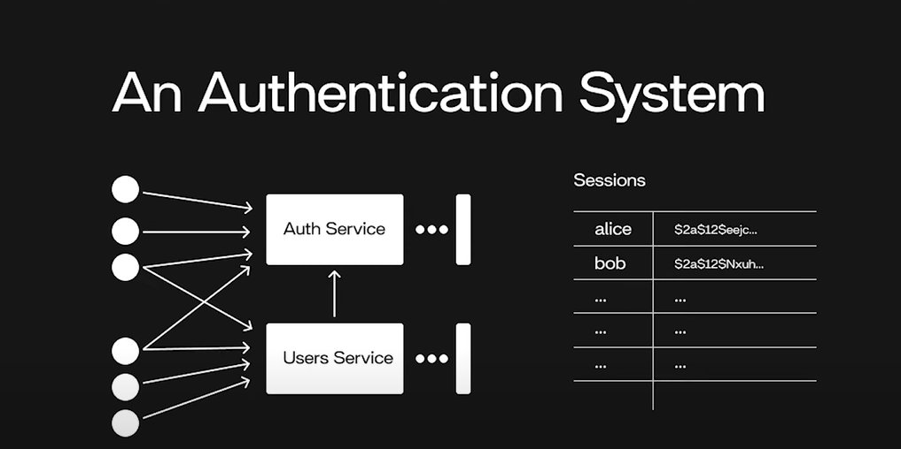

# Simple Authentication System (SAS)

## Overview
The Simple Authentication System (SAS) is designed to provide a secure and efficient way for users to authenticate themselves in an application. It includes mechanisms for login, authentication, and secure communication with the backend system.

## Components
1. **App (Client)**:
   - Sends authentication requests to the backend.
   - Handles user interactions such as login and logout.

2. **Authentication API (Auth API)**:
   - Processes login credentials.
   - Issues secure authentication tokens (e.g., JWT) upon successful login.
   
3. **Secret Key (SEC2ETj)**:
   - Used for encrypting authentication tokens and securing communication.
   
4. **Loud (Cloud Storage or Database)**:
   - Stores user authentication details securely.
   
5. **Access Control & Role Management**:
   - Defines user roles and permissions.
   - Ensures that only authorized users can access specific resources.

## Authentication Flow

1. **User Login**:
   - The user enters their credentials (username & password) in the app.
   - The app sends these credentials to the Auth API.
   
2. **Verification & Token Generation**:
   - The Auth API verifies the credentials against stored user data.
   - If valid, a secure token (e.g., JWT) is generated and sent to the client.

3. **Access Management**:
   - The client uses the token for making requests to protected resources.
   - The API verifies the token before granting access.

4. **Logout Process**:
   - The user logs out, and the token is invalidated.

## Security Considerations
- **Data Encryption**: Ensure all sensitive data is encrypted in storage and during transmission.
- **Token Expiry & Refresh**: Implement token expiration and refresh mechanisms.
- **Multi-Factor Authentication (MFA)**: Optionally add MFA for enhanced security.
- **Rate Limiting & Brute Force Protection**: Prevent repeated login attempts by enforcing rate limits.

## Capacity Considerations
- The system should handle multiple concurrent authentication requests efficiently.
- Optimize database queries for user verification.
- Implement caching mechanisms to speed up authentication processes.

## Future Enhancements
- Integration with OAuth and third-party authentication providers.
- Biometric authentication support.
- Real-time monitoring and logging of authentication attempts.

