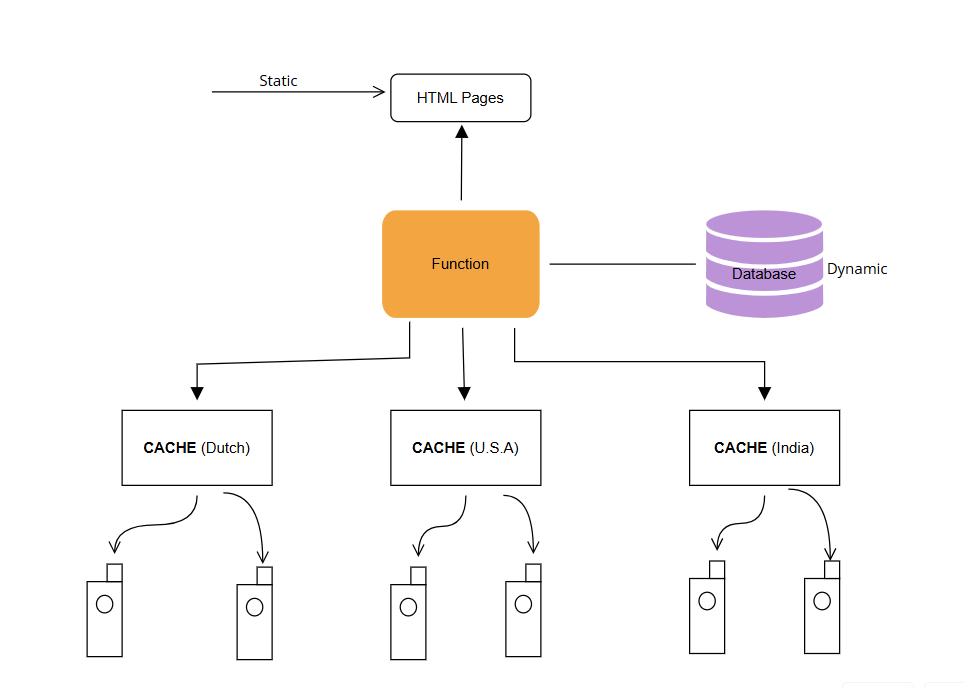

# Content Delivery Network (CDN) - README

## Overview
A Content Delivery Network (CDN) is a distributed system designed to deliver static and dynamic content efficiently. It caches content across multiple geographical locations to reduce latency, improve load times, and optimize bandwidth usage.

## Requirements
- **Caching Mechanism**: Edge servers must store frequently accessed content to reduce latency.
- **Load Balancing**: Efficient traffic distribution among multiple cache nodes.
- **Scalability**: Ability to scale up with increasing traffic.
- **Data Synchronization**: Ensure consistency between cache and the database.
- **Security**: Implement HTTPS, DDoS protection, and secure user authentication.

## Capacity Planning
- **Storage**: Each cache node should have high-speed SSD storage for quick content retrieval.
- **Bandwidth**: Ensure sufficient bandwidth to handle peak traffic.
- **Server Distribution**: Optimize the number of cache nodes to cover key user regions efficiently.
- **Replication Strategy**: Frequently accessed data should be replicated across multiple locations.

# High Level Design

1. **User Requests**: Users request static and dynamic content via a website.
2. **Function Layer**: Processes the request and determines whether to fetch data from cache or the database.
3. **Caching Nodes**: Content is distributed across different caching locations:
   - **Cache (Dutch)**
   - **Cache (U.S.A)**
   - **Cache (India)**
4. **Database**: Stores dynamic content, which is fetched if the requested content is not available in cache.
5. **HTML Pages**: Static content is directly served to users for faster delivery.

## Future Enhancements
- **AI-Based Caching**: Implement machine learning algorithms to predict content demand.
- **Edge Computing**: Process some dynamic requests at edge locations to reduce database load.
- **Global Expansion**: Add more caching locations to enhance global coverage.
- **Improved Compression**: Use efficient algorithms for reducing data transfer size.

