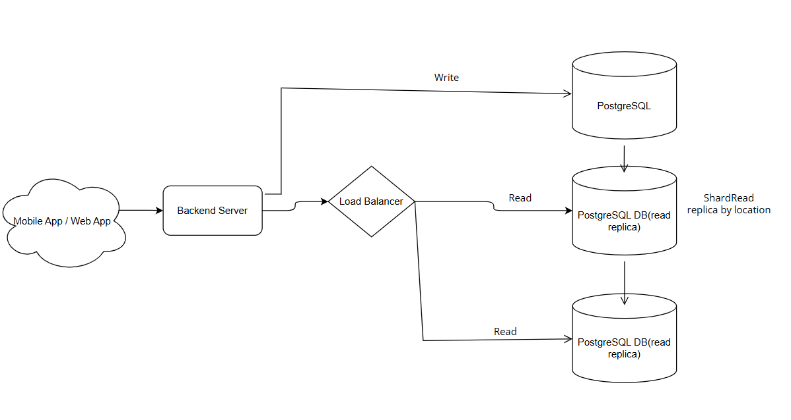

# Parking Garage System Design

## 1. Introduction

This document outlines the design for a **Parking Garage System**, which allows users to reserve parking spots, make payments, and manage reservations efficiently. The system prioritizes **high consistency** to prevent double booking and supports different vehicle types with variable pricing.

## 2. Functional Requirements

- **Reserve a parking spot** and receive a ticket/receipt.
- **Make payments** for a reserved parking spot.
- **High consistency**, ensuring no two people reserve the same spot at the same time.
- Support for **three vehicle types**:
  - Compact
  - Regular
  - Large
- **Flat rate pricing** based on duration, with different rates for each vehicle type.

## 3. Public Endpoints

```
+-------------------------+---------------------------------------------+
| Endpoint               | Parameters                                  |
+-------------------------+---------------------------------------------+
| Spot Reservation       | garage_id, start_time, end_time             |
|                        | Returns: spot_reservation_id                |
+-------------------------+---------------------------------------------+
| Payment                | reservation_id                              |
|                        | Note: Handled via external API (Stripe)     |
+-------------------------+---------------------------------------------+
| Cancel Reservation     | reservation_id                              |
+-------------------------+---------------------------------------------+
```

## 4. Internal Endpoints

```
+-------------------------+---------------------------------------------+
| Endpoint               | Parameters                                  |
+-------------------------+---------------------------------------------+
| Calculate Payment      | reservation_id                              |
+-------------------------+---------------------------------------------+
| Free Spot Availability | garage_id, vehicle_type, time               |
|                        | Note: Smaller vehicles fit larger spots     |
+-------------------------+---------------------------------------------+
| Account Creation       | email, password, first_name, last_name      |
+-------------------------+---------------------------------------------+
| Spot Allocation        | garage_id, vehicle_type, time               |
+-------------------------+---------------------------------------------+
| User Login            | email, password                             |
+-------------------------+---------------------------------------------+
```

## 5. Data Schema

### 5.1 Reservations

| Column      | Type       | Constraints                       |
| ----------- | ---------- | --------------------------------- |
| id          | PK, serial | Unique reservation ID             |
| garage_id   | FK, int    | Foreign key referencing `garages` |
| spot        | FK, int    | Foreign key referencing `spots`   |
| start_time  | timestamp  | Start time of reservation         |
| end_time    | timestamp  | End time of reservation           |
| paid        | boolean    | Payment status                    |

### 5.2 Garages

| Column        | Type        | Constraints              |
| ------------- | ----------- | ------------------------ |
| id            | PK, varchar | Unique garage identifier |
| zipcode       | varchar     | Zip code location        |
| rate_compact  | decimal     | Rate for compact spots   |
| rate_regular  | decimal     | Rate for regular spots   |
| rate_large    | decimal     | Rate for large spots     |

### 5.3 Users

| Column      | Type       | Constraints                       |
| ----------- | ---------- | --------------------------------- |
| id          | PK, serial | Unique user ID                    |
| garage_id   | FK, int    | Foreign key referencing `garages` |
| email       | varchar    | User email                        |
| password    | varchar    | Encrypted password                |
| first_name  | varchar    | First name                        |
| last_name   | varchar    | Last name                         |

### 5.4 Vehicles

| Column        | Type       | Constraints                        |
| ------------- | ---------- | ---------------------------------- |
| id            | PK, serial | Unique vehicle ID                  |
| user_id       | FK, int    | Foreign key referencing `users`     |
| vehicle_type  | enum       | Compact, Regular, Large            |
| license       | varchar    | License plate number               |

### 5.5 Spots

| Column       | Type       | Constraints                       |
| ------------ | ---------- | --------------------------------- |
| id           | PK, serial | Unique spot ID                    |
| garage_id    | FK, int    | Foreign key referencing `garages` |
| vehicle_type | enum       | Compact, Regular, Large           |
| status       | enum       | Available, Reserved, Occupied     |

## 6. System Architecture

# High Level Design


Web App / Mobile App
- Users can reserve parking spots, make payments, and manage reservations through the web or mobile app.
Backend Server
- Handles user requests, processes payments, and interacts with the database and load balancer to manage reservations.
Load Balancer
- Distributes incoming traffic across multiple servers to ensure high availability and reliability to PostgreSQL database(read replica which perform shard read replication by location) and Redis cache.
PostgreSQL Database
- Stores user data, reservations, garages, spots, and vehicle information.
Redis Cache
- Caches frequently accessed data to reduce latency and improve performance.

