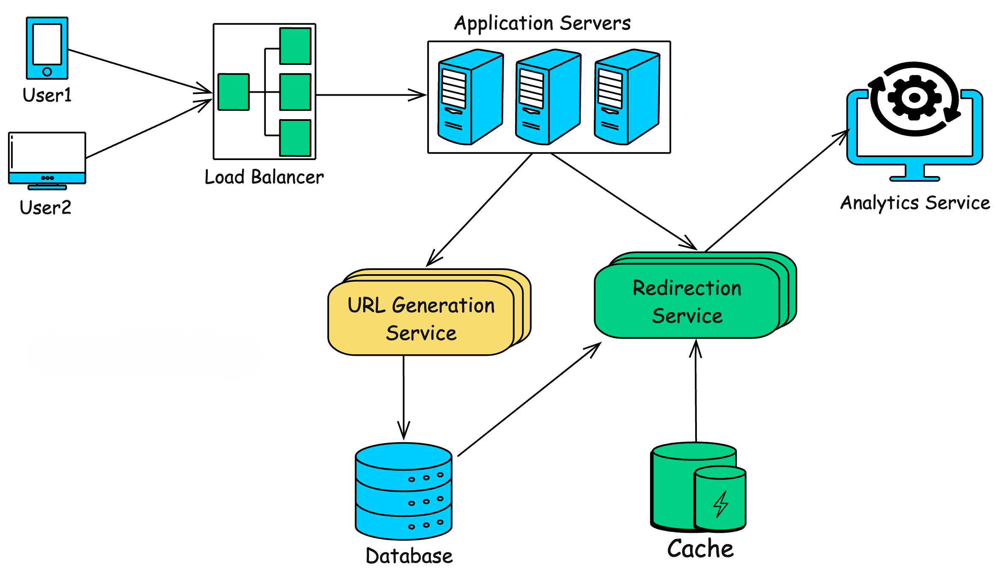

# URL Shortener System Design

## 1. Introduction
A URL shortener is a system that converts long URLs into shorter, unique links and redirects users to the original URL when accessed. This document outlines the functional and non-functional requirements, system architecture, and capacity planning for a scalable and highly available URL shortening service.

## 2. Functional Requirements
- **Generate a unique short URL** for a given long URL.
- **Redirect users** to the original URL when the short URL is accessed.
- **Custom short URLs** (optional) allowing users to define a preferred alias.
- **Link expiration** after a configurable time period.
- **Analytics** on link usage (optional), tracking metrics like clicks and locations.

## 3. Non-Functional Requirements
- **High Availability:** 99.9% uptime.
- **Low Latency:** URL shortening and redirects should happen in milliseconds.
- **Scalability:** Handle millions of requests per day.
- **Durability:** URLs should remain functional for years.
- **Security:** Prevent abuse like phishing and spam.

## 4. System Architecture
The system follows a **distributed architecture** for scalability and reliability.

### 4.1 Components Overview
1. **Load Balancer**: Distributes incoming traffic across multiple application servers.
2. **Application Server**: Processes requests for shortening and redirecting URLs.
3. **Database (NoSQL + SQL)**:
   - **NoSQL (e.g., Redis)**: Cache frequently accessed short URLs for quick lookups.
   - **SQL (e.g., PostgreSQL, MySQL)**: Stores mapping of long URLs to short URLs persistently.
4. **Hash Generator**: Generates unique short URL identifiers.
5. **Analytics Service (Optional)**: Tracks and logs click events for insights.
6. **Expiration Service**: Periodically removes expired short URLs.

# High Level Design

**1. Load Balancer:** Distributes incoming requests across multiple application servers.

**2. Application Servers:** Handles incoming requests for shortening URLs and redirecting users.

**3. URL Generation Service:** Generates short URLs, handles custom aliases, and manages link expirations.

**4. Redirection Service:** Redirects the users to the original URL.

**5. Database:** Stores mappings between short URLs and long URLs.

**6. Cache: Stores frequently** accessed URL mappings for faster retrieval.

**7. Analytics Service (optional):** Tracks usage statistics like the number of clicks, geographic location, etc.

## 5. Bandwidth and Capacity Estimation

### 5.1 Traffic Estimation
- Assume **100 million requests per day**.
- Peak traffic: **2,000 requests per second**.

### 5.2 Storage Estimation
- If each entry is **500 bytes** (URL + metadata),
- For **100 million URLs**, we need **50GB per day**.
- For 5 years: **(50GB * 365 * 5) ≈ 91TB** (distributed across multiple DB instances).

### 5.3 Bandwidth Estimation
- Assume average URL request is **300 bytes** (short URL request + metadata).
- **100 million requests/day** → (300B * 100M) = **30GB/day**.

## 6. Security Considerations
- **Rate Limiting** to prevent abuse.
- **Blacklist Malicious URLs** (phishing, spam, malware detection).
- **HTTPS Enforcement** to prevent MITM attacks.
- **API Key Authentication** for user-created short links.

