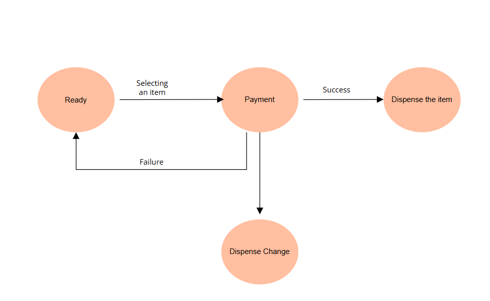
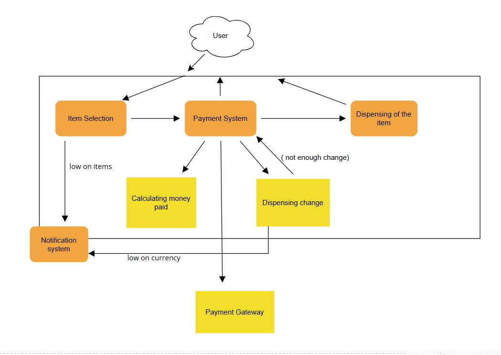

# Vending Machine Design

## Overview
This document outlines the design of a vending machine with key functionalities, including item selection, payment processing, item dispensing, and inventory status notifications.

## Features

1. **Item Selection**
   - Users can select an item from an available list.
   - The system will display the price of the selected item.
   - If the item is low on stock, a notification is sent to the inventory system.

2. **Payment Processing**
   - Supports cash payments.
   - Verifies if sufficient money has been inserted.
   - Calculates the amount paid.
   - If insufficient change is available, the system notifies the user and may cancel the transaction.
   - Integrates with a payment gateway for enhanced transaction handling.

3. **Item Dispensing**
   - Checks inventory before dispensing.
   - Releases the selected item if payment is successful.
   - If payment fails, the system returns to the ready state.

4. **Change Dispensing**
   - If applicable, change is calculated and dispensed.
   - If not enough change is available, the system notifies the user and may revert the transaction.

5. **Inventory & Notification System**
   - Monitors stock levels and sends alerts when an item is low.
   - Tracks currency levels and notifies the system if running low on change.
   - Sends updates to the owner about inventory and cash availability.

# High Level Design

1. **User Interface**
   - Physical buttons or touchscreen for item selection.
   - Display screen for item details and payment information.

2. **Payment System**
   - Accepts and validates cash payments.
   - Calculates and verifies payment amounts.
   - Communicates with a payment gateway for additional functionality.

3. **Item Storage & Dispenser**
   - Mechanism to release the selected item.
   - Sensors to track available stock.

4. **Change Management**
   - Dispenses change after verifying currency availability.
   - Notifies the owner if the machine is low on change.

5. **Inventory & Notification System**
   - Tracks the number of each item in stock.
   - Sends notifications when stock is low.
   - Alerts the owner if currency levels are insufficient.

## Workflow
1. The user selects an item.
2. The machine displays the item price.
3. The user inserts cash payment.
4. The system calculates and verifies the amount paid.
5. If payment is successful, the item is dispensed.
6. If applicable, change is dispensed.
7. If there is insufficient change, the system notifies the user.
8. The inventory and currency levels are updated.
9. Notifications are sent for low stock or low currency levels.

## Future Enhancements
- Support for digital payments (credit/debit cards, mobile wallets).
- Remote monitoring of inventory.
- Customizable user interface with touchscreens.
- Integration with mobile apps for pre-selection and quick checkout.

