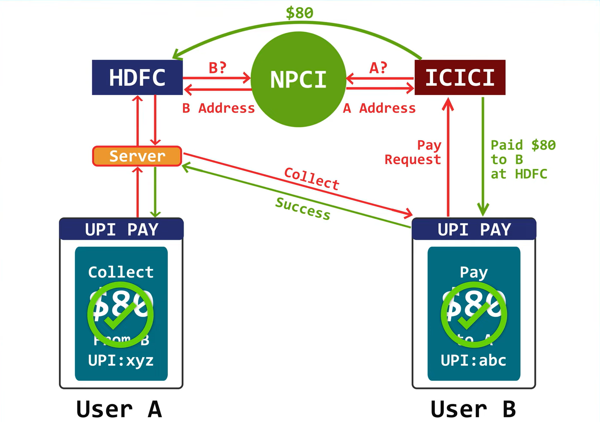

# UPI (Unified Payments Interface)

## Overview
Unified Payments Interface (UPI) is a real-time payment system developed by the National Payments Corporation of India (NPCI). It enables users to instantly transfer funds between bank accounts using a mobile phone. UPI operates 24/7 and facilitates transactions through Virtual Payment Addresses (VPA), UPI IDs, and QR codes.

---

## 📌 **System Requirements**

### **1. Hardware Requirements:**
- Mobile device with internet connectivity (Android/iOS)
- Secure banking servers with high availability
- High-performance network infrastructure to handle concurrent transactions

### **2. Software Requirements:**
- UPI-enabled mobile banking apps
- APIs for secure communication between banks and NPCI
- Encryption mechanisms (SSL/TLS) for data security

---

## 📌 **Capacity & Performance Considerations**

| **Feature**                     | **Specification**                                  |
|---------------------------------|----------------------------------------------------|
| Transaction Speed               | Real-time (few seconds)                            |
| Maximum Transactions per second | 50,000+ TPS                                        |
| Availability                    | 24/7 service uptime                                |
| Security Standards              | End-to-end encryption, multi-factor authentication |
| Supported Banks                 | 200+ banks integrated with UPI                     |
| Transaction Limit               | ₹1 lakh per transaction (as per NPCI regulations)  |

---

# High Level Design

The provided diagram represents the UPI payment flow between two users:

### **1. Users (User A & User B)**
- User A (Receiver) requests money from User B (Sender).
- User B initiates a payment to User A using UPI credentials.

### **2. UPI Payment App**
- The app interfaces with the bank to process transactions securely.
- It allows users to pay and collect money using their UPI ID.

### **3. Bank Servers (HDFC & ICICI)**
- The sender’s and receiver’s banks process UPI transactions.
- Each bank validates the user's request and checks account balance before processing transactions.

### **4. NPCI (National Payments Corporation of India)**
- Acts as the central entity for UPI transactions.
- Validates and routes the transaction from the sender’s bank to the receiver’s bank.
- Ensures security and real-time settlement.

### **5. Transaction Flow**
- User B initiates a payment of $80 to User A.
- The payment request is processed through the sender’s bank (ICICI) and then verified by NPCI.
- NPCI routes the transaction to User A’s bank (HDFC).
- The transaction is marked as successful and the amount is credited to User A’s account.

---

## 📌 **Security & Compliance**
- **End-to-End Encryption:** Ensures safe transaction processing.
- **Two-Factor Authentication:** UPI PIN verification for every transaction.
- **Fraud Prevention Mechanisms:** NPCI and banks implement fraud detection systems to mitigate risks.
- **RBI & NPCI Regulations:** All transactions comply with Reserve Bank of India’s (RBI) guidelines.

---

## 📌 **Conclusion**
UPI is a revolutionary payment system that simplifies digital transactions with seamless, real-time, and secure fund transfers. It enhances user experience with interoperability across multiple banks, eliminating the need for traditional banking methods.

